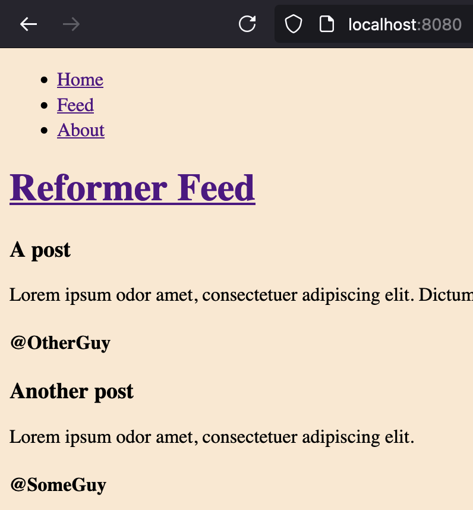
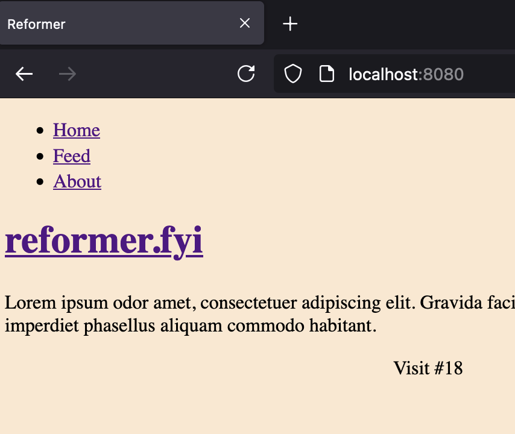

# [`reformer.fyi`](https://reformer.fyi)

## Important Links

- [Live Site](https://reformer-backend-uigfz.ondigitalocean.app/)
- [Live Site - Pretty URL](https://www.reformer.fyi/)
- [Source code](https://git.sr.ht/~jamesaorson/reformer)
- [Source code mirror](https://github.com/exokomodo/reformer)
- [External tool/library documentation](./external/docs/)

## Pipeline Status

- Build [](https://builds.sr.ht/~jamesaorson/reformer/commits/main/build.yml)

- Mirror [](https://builds.sr.ht/~jamesaorson/reformer/commits/main/mirror.yml)

## Dev Videos

- Development Workflow
  - How to develop [`reformer.fyi`](https://www.reformer.fyi) - [Video](https://youtu.be/HrwybAK6XY4)

## Architecture

This site runs on two ports in the production container, but one in local development.

Locally, the site is at [`http://localhost:8080`](https://localhost:8080)

In a container, [`http://localhost:88`](https://localhost:88) is the nginx entrypoint.
If nginx is broken, use [`http://localhost:8080`](https://localhost:8080) to go directly to the running `cfrr`.

## Setup

To setup a system, `root` access is often required. So, if using `sudo`:

```shell
sudo make setup
```

And if not:

```shell
make setup
```

## Development

### Live Reload (Preferred way)

1. Say you open Emacs
1. Open the project
1. Change [`src/reformer/routing.scm:router`](./src/reformer/routing.scm) to the following, to simulate a bug

```scheme
(define (router request request-body)
  (log-request request)
  (let ((path (uri->string (request-uri request))))
    (cond
      ((string=? "/feed" path)
        (set! visits (+ visits 1))
        (home:index visits))
      ((string=? "/" path)
        (set! visits (+ visits 1))
        (feed:index))
      ((string=? "/about" path)
        (set! visits (+ visits 1))
        (about:index))
      (else
        (not-found request)))))
```

1. Run `M-x compile` and execute `make -k run-with-repl-server`
1. Run `M-x geiser-connect`, default host, port `1689`
1. Go to [`http://localhost:8080`](http://localhost:8080) and notice the incorrect pages. 
1. Change the routing function back to what it was.

```scheme
(define (router request request-body)
  (log-request request)
  (let ((path (uri->string (request-uri request))))
    (cond
      ((string=? "/" path)
        (set! visits (+ visits 1))
        (home:index visits))
      ((string=? "/feed" path)
        (set! visits (+ visits 1))
        (feed:index))
      ((string=? "/about" path)
        (set! visits (+ visits 1))
        (about:index))
      (else
        (not-found request))))) ;; Run C-x C-e on this form
```

1. Reload the router form with `C-x C-e`
1. Refresh the browser and witness the live change 

### Locally

#### Without a load balancer and reverse proxy

```shell
make run
```

#### With a load balancer and reverse proxy

Install `nginx` on your system, then run

```shell
make setup-lb
```

After that, you should be able to use

```shell
make run-with-lb
```

### Containerized

```shell
make container-build container-run
```

or using bash magic

```bash
make container-{build,run}
```

`make container-run` will live load the relevant application code from your git repo into the container, via a volume,
allowing for live reloads.
